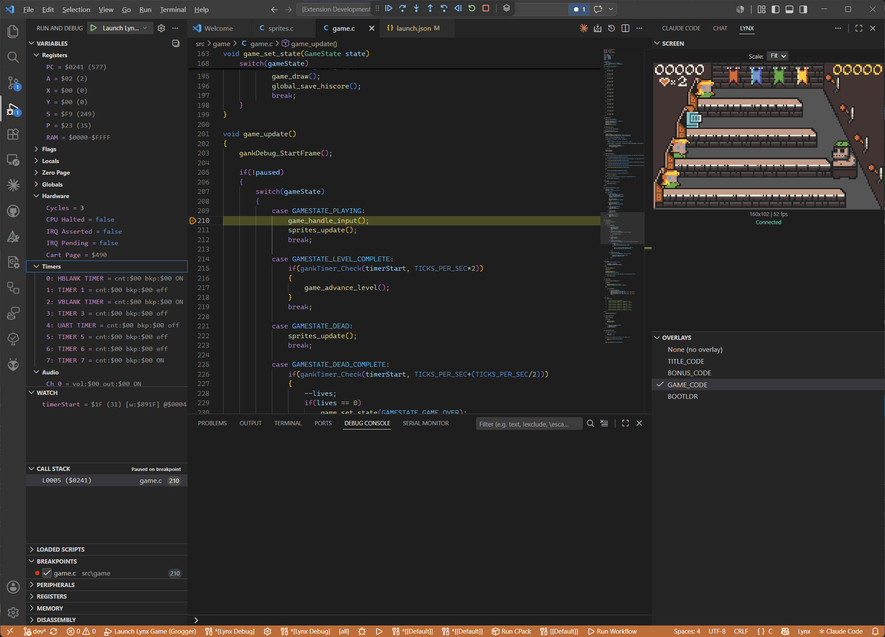

# Gearlynx Debugger - Atari Lynx Source-Level Debugger

> [!WARNING]
> **Not usable yet.** This extension depends on Gearlynx's debug-monitor support
> (the `--debug-monitor` interface and protocol handshake), which currently lives
> only on the `feature/vscplugin` branch of [Gearlynx](https://github.com/DrHelius/Gearlynx)
> and has **not** been merged into a released build. Until those changes land in
> mainline Gearlynx, the extension cannot connect to the emulator and is not
> functional. Published here for development and review only.

A Visual Studio Code debugger extension for Atari Lynx games using the [Gearlynx](https://github.com/DrHelius/Gearlynx) emulator. Supports C and 6502 assembly source-level debugging for games compiled with [cc65](https://cc65.github.io/).



## Features

### Debugging

- **Source-level debugging** for C and 6502 assembly via cc65 `.dbg` files
- **Symbol file fallback** via `.sym` files for assembly-only projects
- **Step controls**: step in, step over, step out, step frame (next VBlank), continue, pause
- **Step back** (frame-level rewind using Gearlynx's rewind feature)
- **Source-line stepping**: steps through 6502 instructions until the source line changes
- **Call stack** with source file locations and symbol names
- **Disassembly view** for stepping through code without source mapping
- **Goto targets**: jump execution to a specific source line

### Breakpoints

- **Source breakpoints** mapped from source lines to 6502 addresses
- **Conditional breakpoints** with register/memory/symbol conditions (e.g. `A == 0`, `$FC00 > 5`)
- **Hit count breakpoints** (break after N hits)
- **Logpoints** with expression interpolation (`Value is {A}, score is {_score}`)
- **Data breakpoints / watchpoints** (read, write, or read/write on memory addresses)
- **Function breakpoints** (break on entry to a named function)
- **Instruction breakpoints** (break at a specific 6502 address)

### Variables and Memory

- **Register inspection**: PC, A, X, Y, S, P with individual flag bits (N, V, B, D, I, Z, C)
- **Local variables** via cc65 scope/csym debug info
- **Global symbols** from cc65 debug info (C variables in writable segments)
- **Zero Page** scope with live memory values for ZP symbols
- **Hardware status**: Mikey timers, audio channels, LCD, and cart status
- **Memory inspection** via VSCode's hex editor (Read Memory / Write Memory)
- **Set Variable** support for registers
- **Hover evaluation** for registers, hex addresses, and symbol names
- **Watch expressions**: registers (`a`, `pc`), hex addresses (`$FC00`, `0x0200`), and symbol names
- **Debug Console** autocomplete for register and symbol names

### Overlays

- **Overlay detection** from cc65 banked ROM segments sharing the same address range
- **Overlay selector** in the status bar for switching active overlay at runtime
- Source resolution respects the active overlay (only shows code from the selected bank)

### Screen Viewer

- **Live screen streaming** at 60fps via raw TCP binary stream
- **Persistent panel** in the VSCode bottom panel (survives editor restarts)
- **Floating viewer** via the `Gearlynx Debugger: Show Screen Viewer` command
- **Gamepad input** through the screen viewer (keyboard events forwarded to emulator)
- Auto-connects when a debug session starts, auto-disconnects when it ends

### Additional Tools

- **Memory Map visualization**: canvas-based address space view showing all segments with overlay column layout
- **Trace Logger**: start/stop CPU trace logging, view output in the "Lynx Trace Log" output panel
- **Loaded Sources**: browse all source files known to the debugger

## Requirements

- [Gearlynx](https://github.com/DrHelius/Gearlynx) emulator built with `--debug-monitor` support
- [cc65](https://cc65.github.io/) toolchain for compiling Lynx games with debug info
- VSCode 1.87.0 or later

## Installing Gearlynx

Gearlynx Debugger does not bundle the emulator. Install [Gearlynx](https://github.com/DrHelius/Gearlynx)
separately, then tell the extension where it is via the `gearlynxDebug.gearlynxPath`
setting (or the per-launch `gearlynxPath` attribute):

```jsonc
// settings.json
"gearlynxDebug.gearlynxPath": "C:\\path\\to\\Gearlynx.exe"
```

On a `launch` configuration the extension starts Gearlynx for you with:

```
Gearlynx --debug-monitor --debug-monitor-port <port> [--headless] <rom>
```

- `--debug-monitor` enables the TCP debug-monitor server (default port `6502`).
- `--debug-monitor-port <port>` overrides the port (the framebuffer stream uses `port + 1`).
- `--headless` runs without the emulator window; use the in-VSCode Screen Viewer instead.

For an `attach` configuration, start Gearlynx yourself with those flags and point
the extension at the host/port.

### Version compatibility

The extension and the emulator negotiate a debug-monitor **protocol version** on
connect. Gearlynx Debugger 0.1.x speaks **protocol version 1**; it requires a Gearlynx
build whose `handshake` reports the same version. On a mismatch the extension
warns but still attempts to debug. The wire format and CLI surface are documented
in [PROTOCOL.md](https://github.com/DrHelius/Gearlynx/blob/main/PROTOCOL.md) in
the Gearlynx repository.

| Gearlynx Debugger | Debug-monitor protocol | Gearlynx |
|-----------|------------------------|----------|
| 0.1.x     | 1                      | builds reporting protocolVersion 1 |

## Quick Start

1. Install the Gearlynx Debugger extension from the Marketplace, or package it locally with `npm run package` and install the resulting `.vsix`.
2. Set the Gearlynx executable path in VSCode settings: `gearlynxDebug.gearlynxPath`
3. Compile your cc65 Lynx game with debug info:
   ```bash
   cl65 -t lynx -g --dbgfile game.dbg -o game.lnx main.c
   ```
4. Create a `.vscode/launch.json` in your game project:
   ```json
   {
     "version": "0.2.0",
     "configurations": [
       {
         "type": "gearlynx",
         "request": "launch",
         "name": "Debug Lynx Game",
         "rom": "${workspaceFolder}/build/game.lnx",
         "stopOnEntry": true
       }
     ]
   }
   ```
5. Press F5 to start debugging

The extension auto-detects `.dbg` or `.sym` files next to the ROM file.

## Launch Configuration

### Launch (starts Gearlynx)

```json
{
  "type": "gearlynx",
  "request": "launch",
  "name": "Launch Lynx Game",
  "rom": "${workspaceFolder}/build/game.lnx",
  "debugFile": "${workspaceFolder}/build/game.dbg",
  "stopOnEntry": true,
  "port": 6502,
  "gearlynxPath": "/path/to/gearlynx",
  "sourceRoots": ["${workspaceFolder}/src"],
  "headless": false,
  "traceSteps": false
}
```

| Attribute | Required | Default | Description |
|-----------|----------|---------|-------------|
| `rom` | Yes | -- | Path to ROM file (.lnx, .lyx, .o) |
| `debugFile` | No | auto-detect | Path to .dbg or .sym file |
| `stopOnEntry` | No | `false` | Pause at entry point |
| `port` | No | `6502` | Debug monitor TCP port |
| `gearlynxPath` | No | from settings | Gearlynx executable path |
| `sourceRoots` | No | `[]` | Extra directories to search for source files |
| `headless` | No | `false` | Run Gearlynx without GUI (use the Screen Viewer in VSCode instead) |
| `traceSteps` | No | `false` | Log source-line stepping decisions to the Debug Console |

### Attach (connects to running Gearlynx)

Start Gearlynx manually with the debug monitor enabled:
```bash
gearlynx --debug-monitor game.lnx
gearlynx --debug-monitor --debug-monitor-port 7000 game.lnx
```

```json
{
  "type": "gearlynx",
  "request": "attach",
  "name": "Attach to Gearlynx",
  "hostname": "localhost",
  "port": 6502,
  "debugFile": "${workspaceFolder}/build/game.dbg",
  "sourceRoots": ["${workspaceFolder}/src"],
  "traceSteps": false
}
```

| Attribute | Required | Default | Description |
|-----------|----------|---------|-------------|
| `debugFile` | No | -- | Path to .dbg or .sym file |
| `hostname` | No | `localhost` | Host running Gearlynx |
| `port` | No | `6502` | Debug monitor port |
| `sourceRoots` | No | `[]` | Extra directories to search for source files |
| `traceSteps` | No | `false` | Log source-line stepping decisions to the Debug Console |

## Settings

| Setting | Default | Description |
|---------|---------|-------------|
| `gearlynxDebug.gearlynxPath` | `""` | Path to Gearlynx executable |
| `gearlynxDebug.defaultPort` | `6502` | Default debug monitor TCP port |
| `gearlynxDebug.autoOpenScreen` | `false` | Automatically open the floating Screen Viewer on session start |

### Keymap Settings

The Screen Viewer captures keyboard input and forwards it to the emulator as Lynx button presses. Default key bindings:

| Setting | Default | Lynx Button |
|---------|---------|-------------|
| `gearlynxDebug.keymap.up` | `ArrowUp` | D-pad Up |
| `gearlynxDebug.keymap.down` | `ArrowDown` | D-pad Down |
| `gearlynxDebug.keymap.left` | `ArrowLeft` | D-pad Left |
| `gearlynxDebug.keymap.right` | `ArrowRight` | D-pad Right |
| `gearlynxDebug.keymap.a` | `z` | A button |
| `gearlynxDebug.keymap.b` | `x` | B button |
| `gearlynxDebug.keymap.option1` | `1` | Option 1 |
| `gearlynxDebug.keymap.option2` | `2` | Option 2 |
| `gearlynxDebug.keymap.pause` | `3` | Pause |

## Commands

All commands are available via the Command Palette (`Ctrl+Shift+P`):

| Command | Description |
|---------|-------------|
| `Gearlynx Debugger: Select Active Overlay` | Switch the active ROM overlay/bank segment |
| `Gearlynx Debugger: Show Screen Viewer` | Open a floating screen viewer window |
| `Gearlynx Debugger: Show Memory Map` | Open the memory map visualization |
| `Gearlynx Debugger: Start Trace Logger` | Begin CPU instruction trace logging |
| `Gearlynx Debugger: Stop Trace Logger` | Stop trace logging |
| `Gearlynx Debugger: Show Trace Log` | Display trace log output |

## Debug Info Formats

### cc65 .dbg files (recommended)

Produced by `ld65 --dbgfile`. Contains full source mapping for C and assembly, including symbols, scopes, spans, and csym entries. Enables all features: source-level stepping, local variables, function call stack, overlays, and memory map.

Build with debug info:
```bash
cl65 -t lynx -g --dbgfile game.dbg -o game.lnx main.c
```

Or with CMake-based projects, ensure `-g` and `--dbgfile` flags are passed to the linker.

### .sym files (fallback)

Provides symbol names and addresses only (no source-line mapping, no locals, no overlays). Supports multiple formats:
- cc65 `.sym` output
- VICE label format (`al CXXXX .label`)
- Generic `ADDRESS LABEL` and `LABEL = $ADDRESS`

## Architecture

```
VSCode                              Gearlynx
+-------------------+   TCP/JSON     +---------------------+
| Gearlynx Debugger | <------------> | Debug Monitor       |
| (DAP adapter)     |   port 6502    | Server              |
+-------------------+                +---------------------+
|                   |   TCP/binary   | Framebuffer         |
| Screen Viewer     | <------------> | Server              |
| (webview panel)   |   port 6503    | (60fps RGBA stream) |
+-------------------+                +---------------------+
                                     | Emulator Core       |
                                     +---------------------+
```

- **Debug protocol**: Content-Length framed JSON over TCP (port 6502 default)
- **Framebuffer stream**: Raw TCP binary -- 8-byte header (width u16 LE, height u16 LE, size u32 LE) followed by RGBA pixel data (port = debug port + 1)
- **DAP adapter**: Runs inline in the extension host process (DebugAdapterInlineImplementation)
- **Single client**: One debugger connection at a time; reconnecting replaces the previous session

## Caveats and Known Limitations

- **cc65 switch statements**: The compiler maps switch dispatch code (jump table) to the closing `}` brace of the switch. Stepping over a `switch(...)` line will stop at the closing brace first, then enter the matching case on the next step. This is a cc65 debug info quirk, not a bug.
- **Local variables**: cc65 often omits stack offsets for local `auto` variables in its debug info. Locals without offset info appear with address-only values.
- **Intermediate files**: cc65-generated assembly files (`.s`, `.mac`, `.inc` intermediates) are automatically filtered from source resolution.
- **Step back**: Uses Gearlynx's rewind feature and operates at frame granularity (one full frame per step-back), not instruction-level.
- **Overlay selection**: Only one overlay bank is active at a time. Source resolution and globals display reflect the selected overlay. Switch overlays via the status bar selector (only appears when overlays are detected in the debug info).
- **Headless mode**: Audio is active in headless mode. The Screen Viewer in VSCode provides the display.
- **Path matching**: Source file paths are matched case-insensitively on Windows.

## Building from Source

```bash
npm install
npm run compile
```

To run the extension in development mode:
1. Open this repository folder in VSCode
2. Press F5 to launch an Extension Development Host
3. In the new window, open your Lynx game project and start debugging

## License

MIT - See [LICENSE](LICENSE) for details.
